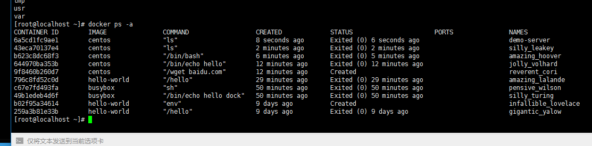
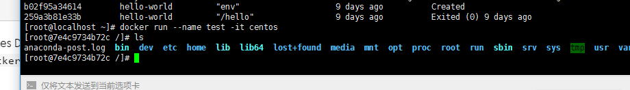
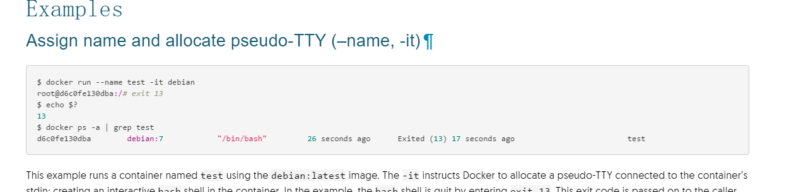
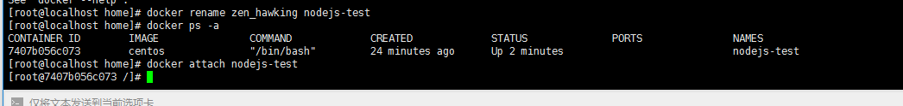
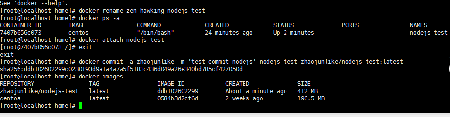
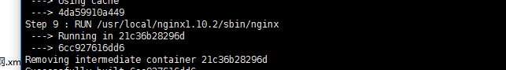
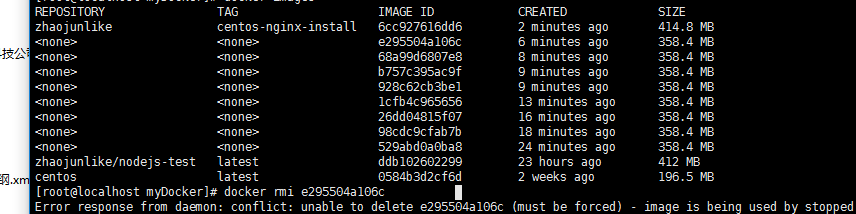
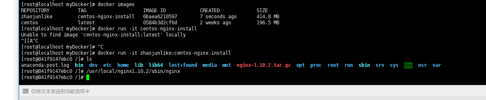

##Step1：了解Docker
>开源的容器平台:Golang https://github.com/docker/docker
>Docker Hub: 用于分享、管理 Docker 容器的 Docker SaaS 平台 -- Docker Hub Docker 使用客户端-服务器 (C/S) 架构模式。Docker 客户端会与 Docker 守护进程进行通信。Docker 守护进程会处理复杂繁重的任务，例如建立、运行、发布你的 Docker 容器。Docker 客户端和守护进程可以运行在同一个系统上，当然你也可以使用 Docker 客户端去连接一个远程的 Docker 守护进程。Docker 客户端和守护进程之间通过 socket 或者 >    RESTful API 进行通信。
>##安装
>我的是centos7.2安装请参考官方的Install的文字文档


##Step2：Docker基本命令

>查看
>$docker search centos
>下载
>$docker pull centos
>使用阿里云的镜像 [阿里云镜像](https://dev.aliyun.com/search.html)
>```
>- 打开管理界面
>- 我的加速器
> 	$sudo cp -n /lib/systemd/system/docker.service /etc/systemd/system/docker.service
> 	$sudo sed -i "s|ExecStart=/usr/bin/docker daemon|ExecStart=/usr/bin/$docker daemon --registry-> mirror=https://***.mirror.aliyuncs.com|g" /etc/systemd/system/docker.service
> 	$sudo systemctl daemon-reload
> 	$sudo service docker restart
> 
>```


##Step3：创建容器
>```
> 	#docker run centos
> 	#docker run 镜像(如果没有这个镜像，就回去自动下载它)
> 	创建容器并执行一个命令
> 	#docker run centos ls
> 	查看正在运行的容器
> 	#docker ps
> 	查看所有得容器
> 	#docker ps -a(-all)
> 
>```

##Step4：管理容器
>```
> 	*基于一个镜像可以创建很多容器
> 	创建容器加名字
> 	#docker run --name demo-server centos /bin/echo 'demo'
> 	查看容器
> 	#docker ps -a
> 	移除容器
> 	#docker rm (容器ID|name)
> 	查看日志
> 	#docker logs demo-server(容器名字)
>```
>	官方的命令文档：[Doc](https://docs.docker.com/engine/reference/commandline/#/container-commands) 
>

##Step5：带互动的容器
>```
> 	Docker Run
> 	使用方法:  docker run [OPTIONS] IMAGE [COMMAND] [ARG...]
> 	创建一个新的容器
> 
> 	#参数optios：
> 	
> 	 带互动的容器，可以进入容器运行内部：
> 	 -i, --interactive                 Keep STDIN open even if not attached
>     大家都知道tty是什么东西了吧
>	 -t, --tty                         Allocate a pseudo-TTY
>	
>	官方一个互动案例：
>```
>我的
>
>
>官方案例：
>
>

##Step6：后台运行一个容器
>```
>   运行后台:
>	-d, --detach                      Run container in background and print container ID	
>	停止运行
>	#docker stop (id|name)
>	删除所有已经停止的容器
>	#docker rm $(docker ps -a -q)
>```

##Step7：退出容器后，重新进入可交互的容器
>```
>退出容器
>#exit
>退出后重新进入可以交互的container
>#docker attach (id|name)
>```	
>


##Step8：基于当前centos的nodejs环境进行提交容器
>```
>##添加
>[官方文档](https://docs.docker.com/engine/reference/commandline/commit/)
>当我们修改了容器后，我们想把这个作为一个新的镜像进行发布
>这里我把centos安装了nodejs环境的作为一个images进行提交
>
>#！当然如果你想学习Nodejs，那么在我的博客中请转移到Nodejs分类目录；
>
>#docker commit -a zhaojunlike -m 'test-commit nodejs' nodejs-test zhaojunlike/nodejs-test:latest
>#
>```
>##移除
>[官方文档](https://docs.docker.com/engine/reference/commandline/rmi/)
>```
>#docker rmi [id|name]
>```
>
>###文档部分提交镜像说明
>```
>Usage:  docker commit [OPTIONS] CONTAINER [REPOSITORY[:TAG]]
>
>Create a new image from a container's changes
>
>Options:
>  -a, --author string    Author (e.g., "John Hannibal Smith <hannibal@a-team.com>")
>  -c, --change value     Apply Dockerfile instruction to the created image (default [])
>      --help             Print usage
>  -m, --message string   Commit message
>  -p, --pause            Pause container during commit (default true)
>```
>
>##查看镜像
>```
>#docker images
>接下来我们使用自己的镜像
>#docker run zhaojunlike/nodejs-test node -e 'console.log(1)'
>输出结果：1
>#
>```
##Step9：如何使用Dockerfile 创建镜像
>[官方文档](https://docs.docker.com/engine/reference/builder/)
>
>Dockerfile中，我们使用指令去指定一些操作的配置，建议对比官方文档，没毛病
>
>指令说明：
>-  FROM:
>```
>- FROM <image>
>- FROM <image>:<tag>
>- FROM <image>@<digest>
>```
>-  MAINTAINER
>```
>作者
>```
>-  RUN
>```
>-  RUN <command> (shell form, the command is run in a shell, which by default is /bin/sh -c on Linux or cmd /S /C on Windows)
>-  RUN ["executable", "param1", "param2"] (exec form)
>```
>-  CMD
>```
>```
>指令太多了，官方文档每一个解释都相当完善
>
>现在我写好了一个Dockerfile文件我们去构建他
>[官方文档](https://docs.docker.com/engine/reference/commandline/build/)
>>由于个人愚昧，我贴了一端安装nginx的代码
>>```
>>#FROM 基于馁个镜像进行创建，这里我们基于我们已经安装好的centos
>>  FROM centos
>>  MAINTAINER zhaojunlike
>>  #当然这里肯定不是这么写的，我只是测试一下
>>  RUN yum install zlib-devel pcre-devel gcc wget make -y
>>  RUN wget http://nginx.org/download/nginx-1.10.2.tar.gz
>>  RUN mkdir /home/tmp
>>  RUN tar -zxf /nginx-1.10.2.tar.gz -C /home/tmp
>>  RUN cd /home/tmp/nginx-1.10.2 && ./configure --prefix=/usr/local/nginx1.10.2/
>>  RUN cd /home/tmp/nginx-1.10.2 &&  make && make install
>>  RUN /usr/local/nginx1.10.2/sbin/nginx
>>```
>然后进行镜像构建
>```
>#[root@localhost myDocker]# docker build --tag zhaojunlike:centos-nginx-install .
>之所以是. docker会自动去当前目录找Dockerfile这个文件
>```
>>当中的过程就是把sh全部丢进去了。
>
>在build成功后我们可以
>```
>#docker images 就可以看到我们的镜像了
>```
>but这些是什么鬼，可能是我在build很多次都不成功产生的cache
>我要去rmi掉
>```
># docker rm $(docker ps -a -q)
>```
>
>然后我们看看馁
>docker真心爽
>
>妈妈再也不容担心，环境安装麻烦啦。
>不过接下来得问题，是让我自己去访问这个镜像里面得nginx web,那么下一篇应该是如何守护进程跑容器，如何进行网络管理了吧


##附页
>docker hub 成千上万的容器，大部分都是其他开发者上传的，我们也去上传一个。
>
>[官方文档](https://docs.docker.com/engine/reference/commandline/login/)
>
>具体工作请看完文档吧


