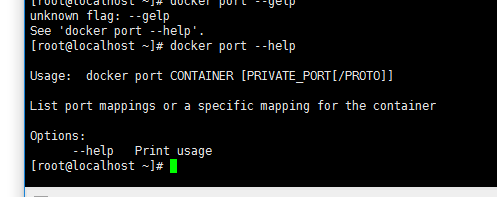
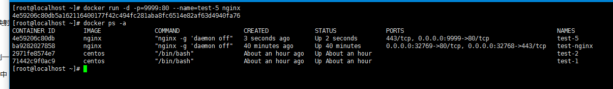
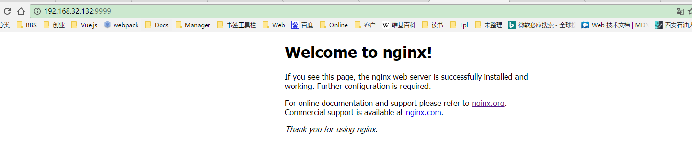

#基础入门之网络容器篇
>####Author:zhaojunlike@
>####Email：zhaojunlike@gmail.com
>####本篇文章来自于官方基于文档的指南学习整理
>####如果英语好的同学其实可以看文档，更加详细。[传送门](https://docs.docker.com/engine/tutorials/networkingcontainers/)


##Step1：网络容器
>##1.部署一个默认网络容器
>```
>查看网络列表
>#docker network ls
>我们看到我们有3个network，bridge是一个特殊的网络，docker默认的在这个网络中启动我们的容器。
>```
>
>```
>Step1:创建一个后台运行的容器，如果您不了解这些命令那么您可以回到第一节blog文章里面查看
>#docker run -itd --name=network-test centos
>Step2:查看容器的ip地址
>#docker network inspect bridge
>Step3:从一个网络中移除一个容器(后面一个参数|the name is faster)
>#docker network disconnect bridge [id|name]
>```
>
>###咦，好像我们docker network还不知道有哪些，我们来help一下
>```
>#docker network 
>Usage:	docker network COMMAND
>
>Manage Docker networks
>
>Options:
>      --help   Print usage

>Commands:
>  connect     Connect a container to a network(让一个容器链接一个网络)
>  create      Create a network(创建一个网络)
>  disconnect  Disconnect a container from a network（取消链接）
>  inspect     Display detailed information on one or more networks（显示网络详细）
>  ls          List networks（网络列表）
>  rm          Remove one or more networks（移除网络）
>
>Run 'docker network COMMAND --help' for more information on a command.
>
>```
>好，我们已经知道了网络的命令我们来试一试
>##2.创建一个网络
>我们还是查看一下docker network create --help
>```
>Usage:	docker network create [OPTIONS] NETWORK
>
>Create a network
>
>Options:
>      --aux-address value    Auxiliary IPv4 or IPv6 addresses used by Network driver (default map[])
>  -d, --driver string        Driver to manage the Network (default "bridge")
>      --gateway value        IPv4 or IPv6 Gateway for the master subnet (default [])
>      --help                 Print usage
>      --internal             Restrict external access to the network
>      --ip-range value       Allocate container ip from a sub-range (default [])
>      --ipam-driver string   IP Address Management Driver (default "default")
>      --ipam-opt value       Set IPAM driver specific options (default map[])
>      --ipv6                 Enable IPv6 networking
>      --label value          Set metadata on a network (default [])
>  -o, --opt value            Set driver specific options (default map[])
>      --subnet value         Subnet in CIDR format that represents a network segment (default [])
>
>```
>###let's go
>```
>创建网络
>#docker network create my-test-d-network
>创建一个容器，加入这个网络
>#docker run -d --network=my-test-d-network --name my-network-test-c centos
>```
>
>我们查看一下刚才创建的容器的网络配置
>```
>#docker inspect --format='{{json .NetworkSettings.Networks}}' my-network-test-c
>  
>```
>好了，到这儿，我们去跟着官方实战一下吧，之前我build了一个已经安装好了nginx的容器，那么现在我将使用这个容器去配置。
>
>```
>Open a shell into the db application again and try the ping command. This time just use the container name web rather than the IP Address.
>#使用容器的名称，而不使用地址
>[root@0037207f115d home]# wget c-test-3
>```
>###从一个网络中，移除一个容器
>```
>#docker network disconnect [network] [container]
>```

##整理一下思路
>###Step1:创建一个网络
>```
>我们取个名字叫test-network
>[root]#docker network create test-network
>```
>###Step2:查看创建网络的信息
>```
>[root]#docker network inspect test-network
>```
>###Step3:创建2个容器
>```
>[root]#docker run -dit --name=test-1 centos
>[root]#docker run -dit --name=test-2 centos
>当然官方也有直接使用一个--network来配置网络的
>```
>###Step4:把2个容器加入网络
>```
>我们先看看帮助
>[root]# docker network connect --help
>接下来我们加入2个容器
>[root@localhost myDocker]# docker network connect test-network test-1
>[root@localhost myDocker]# docker network connect test-network test-2
>```
>
>
>
>```
>接下来我们再查看一下网络的详细
>[root]#docker network inspect test-network
>这样我们就确定了我们的容器已经加入了这个网络，我们看到2个容器在同一个网段里面，接下来我们去ping一下
>```
>
>###Step5:测试网络
>docker有一个这样得方法，去运行我们的容器
>```
>[root]#docker exec -it test-1 bash
>[root]#docker exec -it test-2 bash
>我们是用test-1 ping test-2
>这里我们不是直接去使用ip地址，而是使用docker的名称
>```
>
###补充：端口
>如果我们需要将容器的端口给外界访问，那么我们应该去指定一个端口映射，let's go
>```
>在docker中有一个 port 的命令 ，我们去help一下
>[root]#docker port --help
>如图便是port的映射，我们去开放我们的test-1的80端口，随便映射到一个端口上。
>```
>But 好像port指令无法进行端口的配置，然后我们来到之前的一个文档中，看到在run一个镜像的时候，有一个指定开放端口，我们去看下
>
>尴尬
>
>我们查看#docker run -help
>```
>发布所有暴露端口随机端口。
>  -P, --publish-all                 Publish all exposed ports to random ports
>我们看官方的提示，可以使用p参数进行端口指定
>  docker run -d -p 80:5000 training/webapp python app.py
>```
>我们去试一试，现在我去pull了一个nginx的镜像，接下来我们去创建一个开放了80端口的容器
>```
>[root]#docker run -d -p=9999:80 --name=test-5 nginx 
>[root]#docker ps -a 
>```
>
>我们看到已经把centos本机的9999端口 映射到了容器test-5得80端口上，因为test-5上面的nginx已经启动了，并且在centos 9999得端口已经开放，我们使用ip去访问一下这个端口
>
>这样就说明成功啦，是不是有点小激动。！！


##网络篇结束,下面是我在学习途中遇到的一些问题而寻找的答案。
>Docker run -d：err not running => http://blog.csdn.net/meegomeego/article/details/50707532
>docker port set =>http://blog.csdn.net/libraryhu/article/details/52443447


