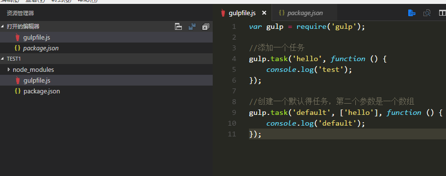
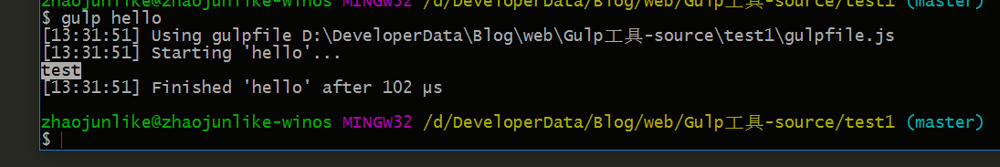
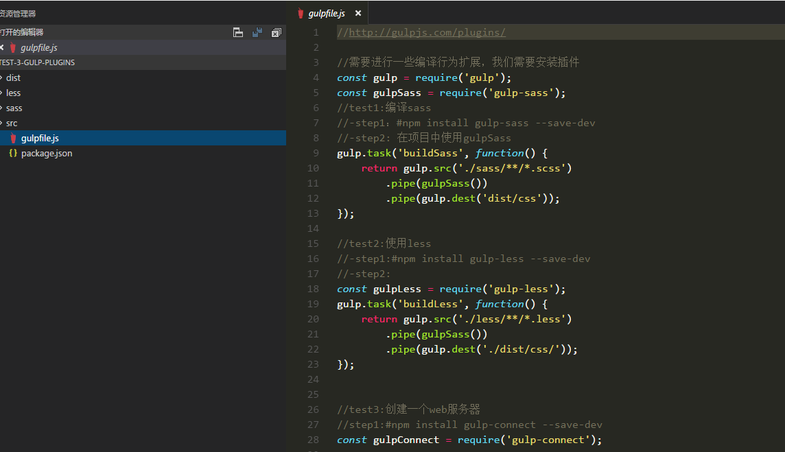

##Gulp
> - Gulp 是一个自动化构建工具,开发者可以使用它在项目开发过程中自动执行常见任务。
> - 前端工具使用中也非常常见，尽管webpack的用户量在急剧上涨，不过我还是挺建议去花时间学一下gulp，
> - 如果喜欢文档中文文档[飞机票](http://www.gulpjs.com.cn/)

##安装gulp
>- 1.由于gulp是基于nodejs平台的，所以得有node环境
>- 2.全局安装gulp，包含了一些命令工具。
>- 3.安装本地的gulp依赖
>
> 安装全局的gulp<code>#npm install -g gulp</code>
> 在项目中使用gulp 安装gulp依赖<code>#npm install gulp --save-dev </code>

##在项目中使用gulp
>step1：初始化项目 <code>#npm init</code>
>step2：安装gulp在项目中<code># cnpm install gulp --save-dev</code>
>step3：全局中创建gulpfile.js告诉gulp要干什么,他相当于是一个配置文件
>step4: gulp的使用方法，<code>#gulp $taskName [$otherTask]</code>
>
>使用gulp执行里面得任务 <code>#gulp hello</code>
>

##gulp中创建任务操作过程
>中文文档[飞机票](http://www.gulpjs.com.cn/docs/api/)
>gulp.task(name[, deps], fn) 指定一个任务
>gulp.src(globs[, options]) 指定文件
>gulp.dest(path[, options])处理文件
>gulp.watch(glob [, opts], tasks) 或 gulp.watch(glob [, opts, cb]) 监视文件变化

##整理gulp使用过程中的一些常用的插件
>插件库[飞机票](http://gulpjs.com/plugins/)
-	gulp-sass （编译sass）
-	gulp-less（编译less）
-	gulp-connect（server）
-	gulp-concat（合并）
-	gulp-uglify（min js）
-	gulp-rename（重命名）
-	gulp-minify-css（最小化css）
-	gulp-imagesmin(最小化图像插件)

##插件使用方法
>
>在test3项目中，有使用和注释

##附件
在我的文档中的src有博客的源代码，使用之前请先安装依赖包<code>#npm install</code>