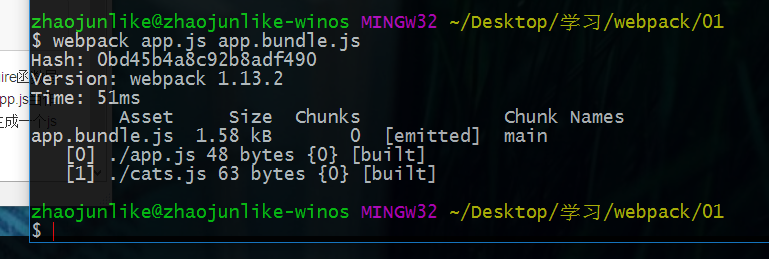
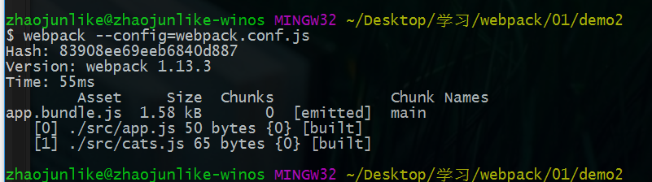
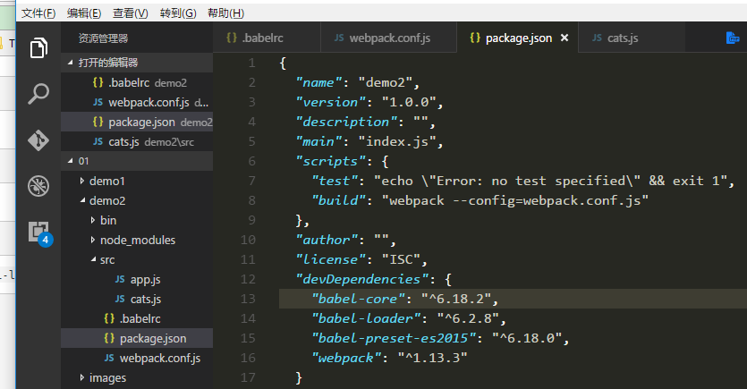
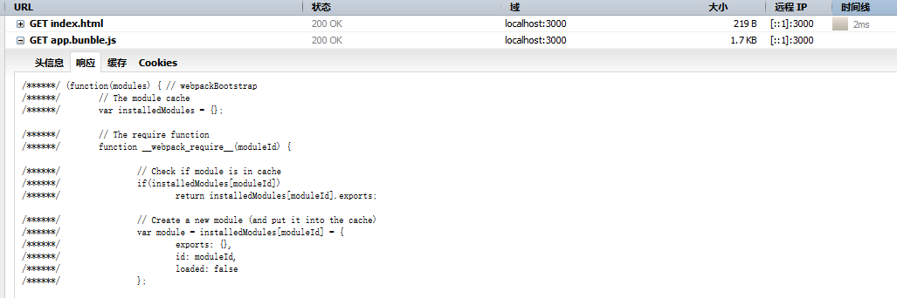

##Webpack入门篇
- 来自于官方文档的整理，如果你英文不错那么建议去看官方文档，老规矩【[飞机票](http://webpack.github.io/docs/usage.html)】
- 项目代码存放[zhaojunlike](https://github.com/zhaojunlike/blogs)
##全局安装Webpack工具
><code>#npm install webpack -g</code>


##开始使用webpack的命令行工具
>step1:
>创建一个符合commonjs规范的js文件【如果你不了解commonjs或者AMD CMD规范，建议可以先去看看这方面的资料】

cats.js
```
var cats = ['dave', 'henry', 'martha'];
module.exports = cats;
```
app.js
```
cats = require('./cats.js');
console.log(cats);
```
其中我们把cats整理成了一个单独的模块，在app中使用require函数导入，现在我们使用webpack命令，将他们打包，我们可以把app.js当作程序的入口文件，webpack会去自动的分析依耐然后帮我们生成一个js文件

>step2:
><code>#webpack app.js app.bundle.js </code>
>

在执行打包后，webpack把appjs打包成一个app.bundle.js,webpack自动分析app.js文件当中的依赖，然后将它打包进输出文件app.bundle.js。

接下来我们去使用node命令执行一下打包后的文件，这样就可以输出了。


##webpack配置文件
webpack是一个非常灵活的打包工具，他提供了很多高级功能，要使用这些功能我们需要像使用gulp或者其他得一些工具一样去创建一个webpack的配置文件。

>step1:

```
#mkdir demo2
#cd demo2
#mkdir src
#mkdir bin
```
安装webpack加入到开发依赖
```
#npm install webpack --save-dev
```
创建一个webpack的配置文件 webpack.conf.js
```
 module.exports = {
     entry: './src/app.js',
     output: {
         path: './bin',
         filename: 'app.bundle.js'
     }
 };
```
同样的webpack文件是commonjs规范，entry：配置入口文件，output：输出文件，这个项目同样，我们把demo1的代码迁移过来，然后运行webpack

>-$webpack --config=webpack.conf.js
>

webpack命令当中<code>--config</code>是指定配置文件的路径,webpack会自动打包。接下来我们去执行一下打包后的文件

```
$ node ./bin/app.bundle.js
[ 'demo1', 'demo2', 'demo3' ]
```
看到这里，你是否觉得webpack很棒呢？接下来是更让人激动人心的，我记得我在使用gulp的时候，每次去创建项目都需要去安装一堆的插件然后创建一堆的任务去交给gulp执行，往往觉得很耽误时间，那我们看看webpack吧。


##webpack中使用各种加载器
前端工程化已经是每一个前端工程师的必备技能了，在我们的项目中我们需要各种各样的编译器去打包生成我们想要的，比如sass less es2015 coffescript typescript，在webpack中可以使用loader去自动的打包这些模块

>babel-loader

>json-loader


个人感觉确实挺奇葩的，我之前学vue的时候，没有好好学习webpack，我很难理解哪些代码或者结构是怎么样编译成最后我们想要的代码的，我也没有详细得去了解，并且创建Vue项目的时候我直接使用了官方的vue-cli脚手架，这样可不是一件好事，我推荐学习的人要好好学习每一个细节。回过头来--

###这次我们使用<code>babel-loader</code>编译es2015的代码
如果你不知道es2015？或者babel那么推荐去学习一下这些东西，
1.安装加载器和预设
```
# npm install --save-dev babel-core babel-preset-es2015
```
2.安装babel-loader
```
# npm install --save-dev babel-loader
```
3.配置预设的配置文件 <code>.babelrc</code>
```
#  { "presets": [ "es2015" ] }
```
4.配置loader到webpack.conf中
```
 module.exports = {
     entry: './src/app.js',
     output: {
         path: './bin',
         filename: 'app.bundle.js',
     },
     module: {
         loaders: [{
             test: /\.js$/,
             exclude: /node_modules/,
             loader: 'babel-loader'
         }]
     }
 }
```
其中test和exclude都是正则表达式的对象
```
We are excluding node_modules here because otherwise all external libraries will also go through Babel, slowing down compilation.

exculde 去排除了node_modules下面的文件
```
这次我们为了操作方便，我们在package.json加入了

这样我们就可以使用去执行我们的 build名称的脚本命令了
```
#npm run build
```
然后我们去添加一个index.html文件创建如下代码
```
<!DOCTYPE html>
<html lang="en">
<head>
    <meta charset="UTF-8">
    <title>Document</title>
</head>
<body>
    <div id="name">
    </div>
        <script src="./bin/app.bunble.js"></script>
</body>
</html>
```
去app.js写点代码

```
cats = require('./cats.js');
console.log(cats);

document.getElementById("name").innerHTML = "zhaojunlike";
let name = "zhaojunlike"
const demo1 = `${name}`;

```

编译<code>#npm run build</code>访问html




##下篇，我们将学习怎么详细使用plugin去处理编译，或者详细了解强大的webpack其他功能

##附加
>英文单词积累：
>- bundle   束, 包, 捆
>- flexible  灵活
>- natively 本机
>- exclude 排除